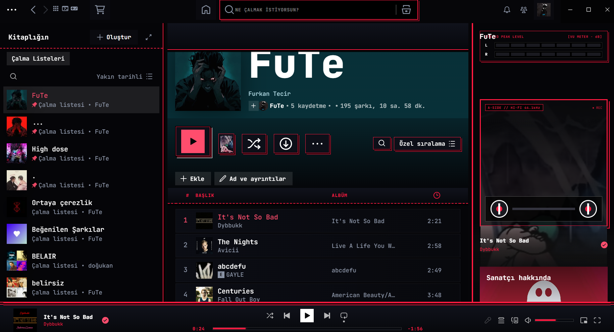

# FuTe Retrobyte

> *Old hardware. New sound.*

A retro arcade & pixel-art inspired theme for Spicetify, combining 80s/90s CRT workstation aesthetics, rotating media decks (Cassette, Vinyl, CD), dynamic reactive cover lighting, retro arcade mini-games, and a built-in command terminal.

---

## Previews



---

## Features

- **Retro Arcade CRT Atmosphere**: Layered CRT depth vignette, ambient phosphor glow, micro-dither matrix, and subtle HUD alignment grid.
- **Interactive Media Decks**:
  - **Cassette Tape**: Rotating dual tape reels with animated recording LED.
  - **Vinyl Turntable**: 33⅓ RPM rotating grooved vinyl with dynamic tonearm.
  - **Holographic CD-ROM**: 90s optical disc with rainbow sheen and laser lens.
- **Dynamic Cover Color**: Real-time extraction of dominant vibrant colors from current album covers (can be toggled on/off).
- **Built-in Retro Arcade Game**: Fully playable 8-bit Snake game with high-score tracking and instant restart (`Ctrl + Shift + S`).
- **Cyber Command Terminal**: Lightweight console for keyboard-driven playback control, volume, theme presets, and telemetry (`Ctrl + Shift + T` or `~`).
- **Hardware Preset Switcher**: Fast modal to swap between color schemes and hardware options (`Ctrl + Shift + P`).
- **Hi-Fi Stereo VU Meter**: Dual-channel LED level bars synced with audio playback state.
- **CRT Scanlines**: Authentic 3px raster overlay with persistent toggle.

---

## Color Schemes

| Scheme | Description |
| :--- | :--- |
| **`Crimson-Red`** *(Default)* | Signature Cyberpunk Laser Red & Blood Neon on Deep Void Obsidian. |
| **`Neon-Outrun`** | 80s Synthwave: Hot Magenta Pink + Electric Cyan on Midnight Violet. |
| **`Toxic-Matrix`** | 90s Hacker Terminal: High-Voltage Radioactive Lime & Matrix Emerald. |
| **`Cyberdeck`** | Ultra Cyberpunk: Electric Cyan & Neon Violet on Obsidian. |
| **`Retrobyte`** | Classic Obsidian CRT base with Amber Phosphor & Electric Blue. |

---

## Keyboard Shortcuts

- `Ctrl + Shift + P` : Hardware Preset & Media Deck Selector
- `Ctrl + Shift + T` or `~` : Cyber Command Terminal
- `Ctrl + Shift + S` : Retro Pixel Snake Arcade Game

---

## Installation

### Prerequisites
Make sure you have [Spicetify](https://spicetify.app/) installed and working.

### 1. Clone or Copy the Theme
Clone this repository into your Spicetify `Themes` folder:

**Windows (PowerShell):**
```powershell
cd "$env:APPDATA\spicetify\Themes"
git clone https://github.com/furkantecir/FuTe-Retrobyte.git
```

**Linux / macOS:**
```bash
cd "$(spicetify -c | xargs dirname)/Themes"
git clone https://github.com/furkantecir/FuTe-Retrobyte.git
```

### 2. Apply the Theme
Run the following commands in your terminal:

```bash
spicetify config current_theme FuTe-Retrobyte color_scheme Crimson-Red
spicetify config inject_css 1 replace_colors 1 inject_theme_js 1
spicetify apply
```

---

## Terminal Commands Reference

When opening the terminal (`Ctrl + Shift + T`):

```text
play / pause / toggle : Control playback
next / prev           : Skip tracks
vol <0-100>           : Set volume (e.g. vol 75)
deck <mode>           : cassette | vinyl | cd | off
dynamic <on|off>      : Toggle dynamic album reactive colors
wallpaper <mode>      : off | grid | city | matrix | <url>
theme <name>          : crimson | outrun | matrix | cyberdeck | retrobyte
game                  : Open Retro Pixel Snake arcade game
crt <on|off>          : Toggle CRT scanline overlay
status                : Display telemetry and track information
clear                 : Clear terminal output
exit                  : Close terminal
```

---

## License
MIT License. Created by [furkantecir](https://github.com/furkantecir).
